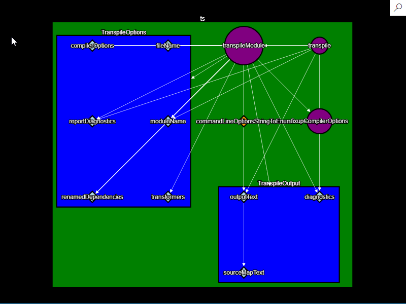
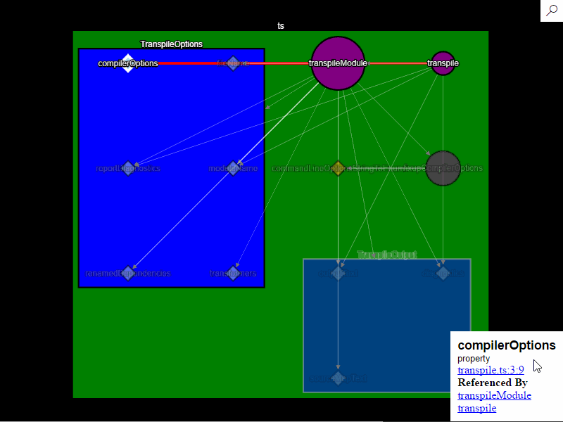
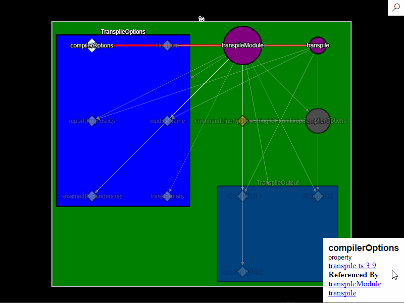
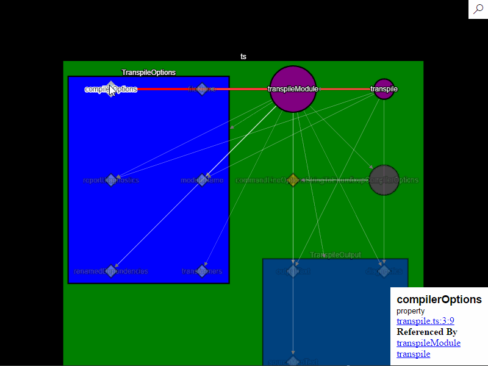

# Typescript UML

Generate diagrams of your typescript and javascript files.

## Features

### Open a diagram  
Open the file to diagram and press alt+shift+t to open a new diagram window. 

### Search for a node
Hit Ctr+f and start typing to search for a node by name. Enter button/click the node to select. If the node is not in the viewport the diagram will be pan to bring that node into view.  

### View Details on specific node
Click a node or edge to see more details about it
Hit esc to close element info

### Hide nodes
Click the node's name to toggle its visibility in the graph.  

### Go to the declaration of the node in the code file

### Rearrange the nodes
Click and drag nodes to move them.

### Undo/Redo changes to the graph
Standard hotkeys ctr+z ctr+y will reverse or replay: node moves, node selections, node hide/show and resets of the node layout.

### Pan and zoom
Arrow keys will pan and ctr + -, ctr + = will zoom in and out

### Save/open diagrams
Ctr+S/Ctr+O to save the diagram to disk. Included in the save file are 
- the current nodes and edges
- positions of the nodes
- current node/edge selected
- visibilities of the nodes
- path to the file compiled
- the undo/redo stacks

## Known Issues

- Layout of nodes does not take into account the references to and from them.
- If there a lot of nodes with the same name they should have some disambiguation especially when searching or listed as references to/from a node
- Expressions without identifiers are not included in the diagram.
- Hiding all children of a node hides it as well.
- Cannot diagram relations between files
